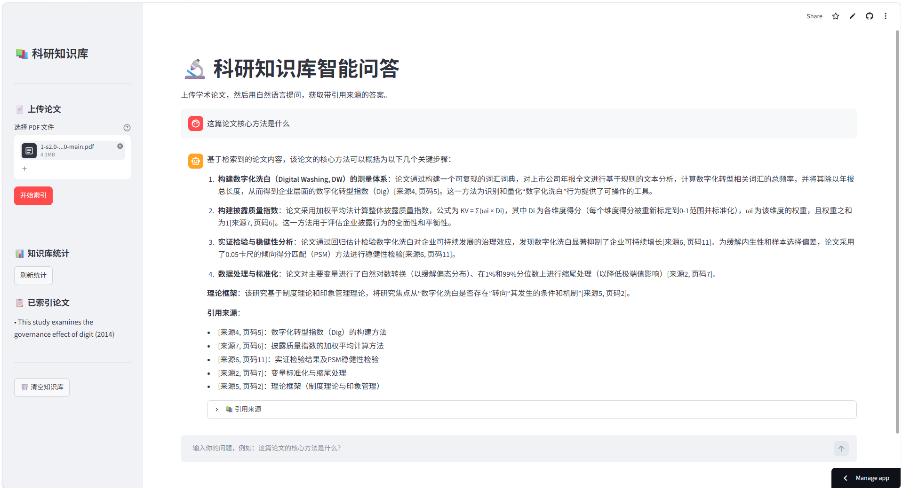
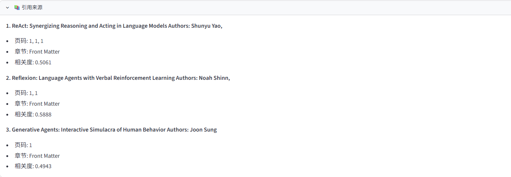
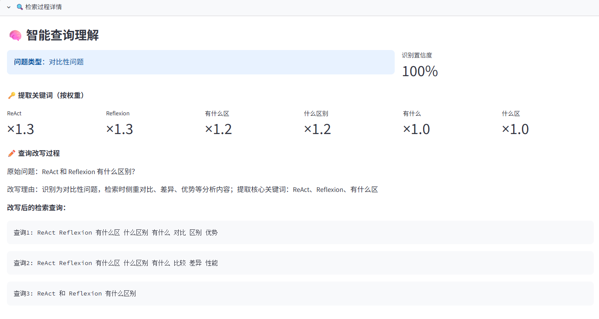
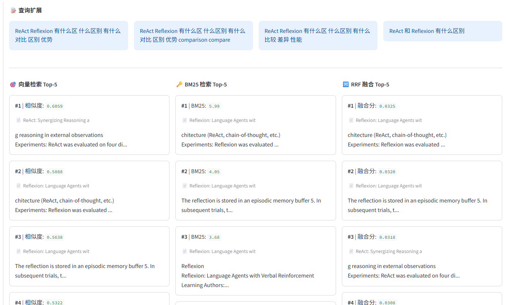
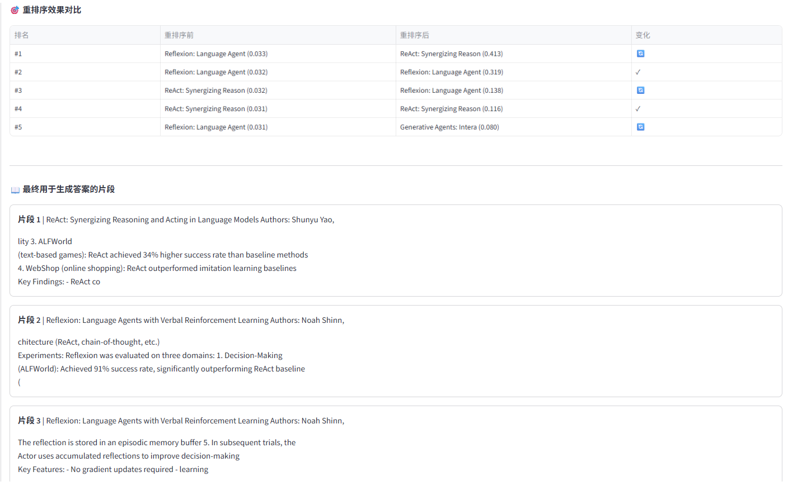

# 科研知识库智能问答 Agent

基于 RAG（检索增强生成）的学术论文智能问答系统，专为大学研究场景设计。

[](https://research-kb-agent-t7s5yow4yie8fynk83tu6m.streamlit.app/)
[](https://github.com/sjy2001/research-kb-agent)

## 在线演示

🚀 **立即体验**：[https://research-kb-agent-t7s5yow4yie8fynk83tu6m.streamlit.app/](https://research-kb-agent-t7s5yow4yie8fynk83tu6m.streamlit.app/)

## 演示截图

### 系统主界面



### 引用来源展示

每个答案都标注论文标题、页码、章节和相关度，支持溯源验证。



### 检索过程可视化

展开"检索过程详情"面板，可完整查看从问题理解到最终检索的全流程。

**智能查询理解**：自动识别问题类型、提取关键词权重、生成学术检索式



**三路检索对比**：向量检索、BM25、RRF 融合结果并排展示



**重排序效果对比**：展示重排序前后的排名变化，直观体现精度提升



## 功能特性

### 核心功能
- 📄 **多格式文档解析**：支持 PDF、TXT、DOCX，批量上传
- 🔍 **混合检索**：向量检索 + BM25 关键词检索，RRF 融合
- 🎯 **智能重排序**：Cross-encoder 重排序模型提升检索精度
- 🧠 **智能查询理解**：问题类型识别 + 关键词权重分配 + 学术查询改写
- 📊 **检索过程可视化**：完整展示查询理解、三路检索对比、重排序效果
- 💬 **多轮对话**：支持上下文追问，保持对话连贯性
- 📚 **来源引用**：每个答案标注论文标题、页码、章节
- 🔄 **查询扩展**：学术同义词扩展，提升检索召回率

### 学术特色
- 学术缩写保护（Fig.、Eq.、et al. 等不被错误切分）
- 句子边界感知分块
- 论文章节结构识别
- 元数据过滤检索

## 技术架构

```
用户提问
   ↓
智能查询理解（问题分类 + 关键词权重 + 查询改写）
   ↓
查询扩展（学术同义词）
   ↓
混合检索 ──┬── 稠密检索（BGE Embedding + ChromaDB）
           ├── BM25 关键词检索
           └── RRF 融合
   ↓
Cross-encoder 重排序
   ↓
上下文构建
   ↓
LLM 生成答案（带引用来源）
```

## 评估实验

基于 20 篇 AI Agent 领域经典论文、30 个测试问题的量化评估结果。

### 检索性能对比

| 检索方法 | Top-1 命中率 | Top-3 命中率 | Top-5 命中率 | MRR |
|----------|-------------|-------------|-------------|-----|
| **混合检索 + 重排序** | **80.0%** | **93.3%** | **93.3%** | **0.856** |
| 混合检索（无重排序） | 70.0% | 76.7% | 80.0% | 0.740 |
| 纯向量检索 | 70.0% | 83.3% | 83.3% | 0.756 |
| 纯 BM25 检索 | 73.3% | 73.3% | 83.3% | 0.757 |

### 消融实验分析

1. **重排序增益**：Cross-encoder 重排序使 Top-1 命中率提升 10%，MRR 提升 0.116
2. **混合检索 vs 纯向量**：Top-1 提升 10%，MRR 提升 0.100
3. **混合检索 vs 纯 BM25**：Top-1 提升 6.7%，MRR 提升 0.099

### 答案质量

- LLM 生成答案关键词命中率：**56.5%**
- 测试集：20 篇论文，227 个文本块，30 个测试问题
- 完整评估报告：[evaluation/evaluation_report.md](evaluation/evaluation_report.md)

## 技术栈

| 组件 | 技术 |
|------|------|
| Agent 框架 | LangChain + LangGraph |
| 向量数据库 | ChromaDB |
| Embedding | BGE-small-zh |
| 重排序 | BGE-reranker-base |
| 文档解析 | PyMuPDF + python-docx |
| 后端 | FastAPI |
| 前端 | Streamlit |
| 部署 | Docker |

## 快速开始

### 1. 安装依赖

```bash
pip install -r requirements.txt
```

### 2. 配置环境变量

```bash
cp .env.example .env
# 编辑 .env，填入你的 API Key
```

### 3. 启动 Web 界面

```bash
streamlit run app/streamlit_app.py
```

### 4. 启动 API 服务（可选）

```bash
python -m app.main
# 或
uvicorn app.main:app --reload
```

## 使用方法

### 上传文档
1. 在侧边栏选择 PDF / TXT / DOCX 文件（支持多选批量上传）
2. 点击"开始索引"
3. 等待解析和向量化完成

### 提问
- 在聊天框输入问题
- 系统自动进行查询理解、检索、重排序
- 回答附带引用来源，展开"检索过程详情"可查看完整检索链路

### API 调用

```bash
# 上传文档
curl -X POST http://localhost:8000/upload \
  -F "file=@paper.pdf"

# 提问
curl -X POST http://localhost:8000/query \
  -H "Content-Type: application/json" \
  -d '{"question": "这篇论文的核心方法是什么？"}'
```

## 项目结构

```
research-kb-agent/
├── src/
│   ├── config.py           # 配置文件
│   ├── document_parser.py  # 通用文档解析（PDF/TXT/DOCX）
│   ├── pdf_parser.py       # PDF 解析与元数据提取
│   ├── chunker.py          # 学术感知分块
│   ├── embedder.py         # 文本向量化
│   ├── vector_store.py     # 向量数据库
│   ├── retriever.py        # 混合检索与重排序
│   ├── query_expander.py   # 查询扩展
│   ├── query_rewriter.py   # 智能查询理解与改写
│   └── agent.py            # Agent 核心逻辑
├── app/
│   ├── main.py             # FastAPI 后端
│   └── streamlit_app.py    # Streamlit 前端
├── data/
│   ├── papers/             # 文档文件存放
│   └── chroma_db/          # 向量数据库
├── evaluation/             # 评估实验
│   ├── test_corpus/        # 20篇测试论文文本
│   ├── test_pdfs/          # 生成的测试PDF
│   ├── test_questions.json # 30 个测试问题
│   ├── run_evaluation.py   # 评估脚本
│   └── evaluation_report.md # 评估报告
├── docs/                   # 文档与截图
├── tests/                  # 测试
├── requirements.txt
├── Dockerfile
└── README.md
```

## 参考项目

- [ScholarRAG](https://github.com/Wh1esky/ScholarRAG/) - 多粒度 RAG 学术论文问答
- [Research Paper RAG System](https://github.com/nasirml/rag-chatbot-research-paper) - 学术论文 RAG 系统
- [LightRAG](https://github.com/HKUDS/LightRAG) - 轻量级 RAG 框架

## 许可证

MIT
